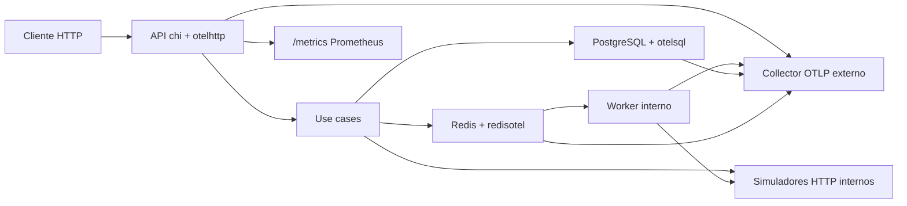

# Go Golden Signals Demo

Demo completa em `Go 1.26.0` para ensinar instrumentação moderna de `traces + metrics` com OpenTelemetry, focada em:

- exportar tudo para um collector OTLP externo
- expor `/metrics` localmente em Prometheus para debug e ensino
- mostrar os quatro golden signals com um fluxo real de negócio
- simular dependências para ficar claro como instrumentar HTTP, Postgres, Redis e worker
- manter código limpo, modular e fácil de adaptar para a app do cliente

## O que esta demo cobre

- API HTTP com `chi`
- PostgreSQL instrumentado com `otelsql`
- Redis instrumentado com `redisotel`
- worker interno com fila e DLQ
- spans automáticos e spans manuais
- métricas automáticas e métricas de negócio
- padrão atual de duração em `seconds`
- `OTEL_SEMCONV_STABILITY_OPT_IN=database` para usar `db.client.operation.duration`
- exportação OTLP HTTP para traces e metrics

## Versões validadas em 20 de março de 2026

### Runtime e bibliotecas principais

- `Go 1.26.0`
- `go.opentelemetry.io/otel v1.42.0`
- `go.opentelemetry.io/contrib v1.42.0`
- `go.opentelemetry.io/contrib/instrumentation/net/http/otelhttp v0.67.0`
- `go.opentelemetry.io/contrib/instrumentation/runtime v0.67.0`
- `go.opentelemetry.io/otel/exporters/otlp/otlptrace/otlptracehttp v1.42.0`
- `go.opentelemetry.io/otel/exporters/otlp/otlpmetric/otlpmetrichttp v1.42.0`
- `go.opentelemetry.io/otel/exporters/prometheus v0.64.0`
- `github.com/go-chi/chi/v5 v5.2.5`
- `github.com/jackc/pgx/v5 v5.8.0`
- `github.com/redis/go-redis/v9 v9.18.0`
- `github.com/redis/go-redis/extra/redisotel/v9 v9.18.0`
- `github.com/XSAM/otelsql v0.41.0`
- `github.com/testcontainers/testcontainers-go v0.41.0`

### Infra local

- `postgres:17-alpine`
- `redis:8.2-alpine`

## Arquitetura



## Fluxo de negócio

`POST /api/v1/orders` faz o seguinte:

1. valida o payload
2. persiste o pedido no PostgreSQL
3. grava o pedido no cache Redis
4. chama simulador de pagamento via HTTP
5. chama simulador de inventário via HTTP
6. enfileira um job de fulfillment no Redis
7. responde `201` com `trace_id`
8. o worker interno consome a fila
9. o worker chama o simulador de shipping
10. em sucesso, marca o pedido como `fulfilled`
11. em falha, tenta novamente
12. ao atingir o limite, envia para DLQ e marca como `failed`

## Endpoints

### Públicos

- `GET /healthz`
- `GET /readyz`
- `GET /metrics`
- `POST /api/v1/orders`
- `GET /api/v1/orders/{id}`

### Simuladores internos

- `POST /internal/sim/payment/authorize`
- `POST /internal/sim/inventory/reserve`
- `POST /internal/sim/shipping/book`

## Estrutura do projeto

```text
go-otel-app/
├── cmd/api
├── internal/domain
├── internal/application
├── internal/ports
├── internal/adapters/http
├── internal/adapters/postgres
├── internal/adapters/redis
├── internal/adapters/simulator
├── internal/adapters/worker
├── internal/platform/bootstrap
├── internal/platform/config
├── internal/platform/database
├── internal/platform/observability
├── test/integration
├── examples/curl
├── docker-compose.yml
├── Makefile
└── .env.example
```

## Por que cada pacote foi escolhido

### `otelhttp`

Usado tanto no servidor quanto no cliente HTTP.

Ele resolve automaticamente:

- spans de request/response
- propagação de contexto
- métricas HTTP como `http.server.request.duration` e `http.client.request.duration`

### `otelsql`

Foi escolhido porque a stack usa `database/sql` com `pgx/stdlib`.

Ele entrega:

- spans de operações SQL
- métricas de operação de banco
- métricas de pool como `db.sql.connection.*`

### `redisotel`

Instrumenta o cliente Redis com traces e metrics.

Isso deixa visível:

- operações de cache
- operações de fila
- profundidade da fila complementada pelas métricas customizadas

### `runtime instrumentation`

Expõe métricas úteis do runtime Go, por exemplo:

- `go.memory.used`
- `go.memory.allocated`
- `go.goroutine.count`
- `go.processor.limit`

## Bootstrap OpenTelemetry

O coração da demo está em criar um `TracerProvider` e um `MeterProvider` com dois destinos para métricas:

1. `PeriodicReader` para o collector OTLP
2. exporter Prometheus para `/metrics`

```go
res, err := resource.New(ctx,
	resource.WithFromEnv(),
	resource.WithTelemetrySDK(),
	resource.WithProcess(),
	resource.WithHost(),
	resource.WithAttributes(
		attribute.String("service.name", cfg.AppName),
		attribute.String("service.version", cfg.ServiceVersion),
		attribute.String("deployment.environment", cfg.DeploymentEnvironment),
	),
)

traceExporter, err := otlptracehttp.New(ctx,
	otlptracehttp.WithEndpointURL(cfg.OTLPTracesEndpoint),
	otlptracehttp.WithHeaders(cfg.OTLPHeaders),
)

metricExporter, err := otlpmetrichttp.New(ctx,
	otlpmetrichttp.WithEndpointURL(cfg.OTLPMetricsEndpoint),
	otlpmetrichttp.WithHeaders(cfg.OTLPHeaders),
)

promExporter, err := otelprom.New(
	otelprom.WithRegisterer(promRegistry),
	otelprom.WithTranslationStrategy(otlptranslator.UnderscoreEscapingWithSuffixes),
)

traceProvider := sdktrace.NewTracerProvider(
	sdktrace.WithBatcher(traceExporter),
	sdktrace.WithResource(res),
)

meterProvider := sdkmetric.NewMeterProvider(
	sdkmetric.WithResource(res),
	sdkmetric.WithReader(sdkmetric.NewPeriodicReader(metricExporter, sdkmetric.WithInterval(10*time.Second))),
	sdkmetric.WithReader(promExporter),
)

otel.SetTracerProvider(traceProvider)
otel.SetMeterProvider(meterProvider)
otel.SetTextMapPropagator(propagation.NewCompositeTextMapPropagator(
	propagation.TraceContext{},
	propagation.Baggage{},
))
```

### Por que isso importa

- traces vão para o collector externo
- metrics vão para o collector externo
- as mesmas metrics também aparecem em `/metrics`
- o Prometheus exporter aplica tradução com sufixos, então os nomes ficam coerentes para scraping humano

## Instrumentando HTTP server

Cada rota é embrulhada com `otelhttp.NewHandler`.

```go
func route(operation, pattern string, handler http.HandlerFunc) http.Handler {
	return otelhttp.NewHandler(
		http.HandlerFunc(handler),
		operation,
		otelhttp.WithSpanNameFormatter(func(_ string, _ *http.Request) string {
			return pattern
		}),
		otelhttp.WithMetricAttributesFn(func(*http.Request) []attribute.KeyValue {
			return []attribute.KeyValue{attribute.String("http.route", pattern)}
		}),
	)
}
```

### O que isso gera

- span inbound da request
- métricas do servidor HTTP em seconds
- propagação automática do contexto para spans manuais abaixo

## Instrumentando HTTP client

As integrações HTTP usam `otelhttp.NewTransport`.

```go
httpClient := &http.Client{
	Timeout:   cfg.RequestTimeout,
	Transport: otelhttp.NewTransport(http.DefaultTransport),
}
```

### O que isso gera

- spans outbound para payment, inventory e shipping
- métricas `http.client.request.duration`
- correlação natural com o trace da request original

## Instrumentando PostgreSQL

O banco é aberto com `otelsql` usando `pgx/stdlib`.

```go
db, err := otelsql.Open("pgx", cfg.DatabaseURL,
	otelsql.WithAttributes(
		attribute.String("db.system.name", "postgresql"),
	),
	otelsql.WithTracerProvider(otel.GetTracerProvider()),
	otelsql.WithMeterProvider(otel.GetMeterProvider()),
)

reg, err := otelsql.RegisterDBStatsMetrics(db,
	otelsql.WithMeterProvider(otel.GetMeterProvider()),
)
```

### O que isso gera

- spans das queries SQL
- `db.client.operation.duration`
- `db.sql.connection.*`

### Ponto importante de 2026

Para usar a semconv nova de banco, a demo define:

```bash
OTEL_SEMCONV_STABILITY_OPT_IN=database
```

Sem isso, algumas instrumentações de banco ainda podem expor métricas legadas em milissegundos.

## Instrumentando Redis

Redis está instrumentado tanto para traces quanto para metrics.

```go
if err := redisotel.InstrumentTracing(client,
	redisotel.WithTracerProvider(otel.GetTracerProvider()),
	redisotel.WithDBStatement(true),
); err != nil {
	return nil, err
}

if err := redisotel.InstrumentMetrics(client,
	redisotel.WithMeterProvider(otel.GetMeterProvider()),
); err != nil {
	return nil, err
}
```

### O que isso gera

- spans de cache
- spans de fila/DLQ
- métricas de cliente Redis baseadas nas semantic conventions de database

## Spans manuais no caso de uso

Além da instrumentação automática, a demo cria spans manuais nas partes mais importantes do fluxo.

```go
ctx, span := uc.Tracer.Start(ctx, "order.create")
defer span.End()

order, err := uc.validateAndBuild(ctx, input)
if err != nil {
	recordSpanError(span, err)
	uc.Metrics.RecordOrderCreate(ctx, time.Since(start), "failed")
	uc.Metrics.IncrementOrderFailed(ctx, "validate", errorType(err))
	return domain.Order{}, err
}
```

Outros spans manuais do fluxo:

- `order.create.validate`
- `order.create.persist`
- `order.create.cache`
- `order.create.enqueue_fulfillment`
- `worker.fulfillment.process`
- `worker.fulfillment.persist_result`

## Worker, retry e DLQ

O worker consome a fila Redis com `BRPOP`, mede profundidade da fila e faz retry antes de enviar para a DLQ.

```go
if err := uc.Shipping.Book(ctx, order, job); err != nil {
	recordSpanError(span, err)
	if uc.shouldRetry(job) {
		retryJob := job
		retryJob.Attempt++
		if enqueueErr := uc.Queue.Enqueue(ctx, retryJob); enqueueErr != nil {
			recordSpanError(span, enqueueErr)
			return enqueueErr
		}

		uc.Metrics.RecordJobDuration(ctx, time.Since(start), "retry")
		uc.Metrics.IncrementOrderFailed(ctx, "shipping_retry", errorType(err))
		return err
	}

	if persistErr := uc.persistResult(ctx, order.ID, domain.OrderStatusFailed, err.Error()); persistErr != nil {
		recordSpanError(span, persistErr)
		return persistErr
	}
	if dlqErr := uc.Queue.SendToDLQ(ctx, job, err.Error()); dlqErr != nil {
		recordSpanError(span, dlqErr)
		return dlqErr
	}
}
```

## Métricas customizadas de negócio

Além das métricas automáticas, a demo cria métricas explícitas para tornar os golden signals mais didáticos.

```go
orderCreateDuration, err := meter.Float64Histogram(
	"app.order.create.duration",
	metric.WithUnit("s"),
	metric.WithDescription("Duration of the order creation use case."),
)

orderCreated, err := meter.Int64Counter(
	"app.order.created",
	metric.WithUnit("{order}"),
	metric.WithDescription("Number of orders created successfully."),
)

queueDepthGauge, err := meter.Int64ObservableGauge(
	"app.fulfillment.queue.depth",
	metric.WithUnit("{job}"),
	metric.WithDescription("Current number of jobs waiting in the fulfillment queue."),
)
```

## Golden Signals mapeados para métricas concretas

| Golden signal | Métricas principais | Onde olhar |
| --- | --- | --- |
| Latency | `http_server_request_duration_seconds`, `http_client_request_duration_seconds`, `db_client_operation_duration_seconds`, `app_order_create_duration_seconds`, `app_fulfillment_job_duration_seconds` | collector e `/metrics` |
| Traffic | volume de requests HTTP, `app_order_created_total` | collector e `/metrics` |
| Errors | status HTTP 4xx/5xx, `app_order_failed_total`, atributo `error.type`, falhas de shipping indo para DLQ | traces e metrics |
| Saturation | `app_fulfillment_queue_depth_jobs`, `app_fulfillment_worker_active_workers`, `db_sql_connection_*`, métricas de runtime Go | collector e `/metrics` |

## Como rodar localmente

### 1. Preparar variáveis

```bash
cd go-otel-app
cp .env.example .env
```

Edite o `.env` e aponte estes campos para o seu collector:

```bash
OTEL_EXPORTER_OTLP_TRACES_ENDPOINT=http://SEU-COLLECTOR:4318/v1/traces
OTEL_EXPORTER_OTLP_METRICS_ENDPOINT=http://SEU-COLLECTOR:4318/v1/metrics
OTEL_EXPORTER_OTLP_HEADERS=authorization=Bearer%20SEU_TOKEN
```

### 2. Subir dependências locais

```bash
make up
```

Isso sobe apenas:

- PostgreSQL
- Redis

### 3. Instalar dependências Go

```bash
go mod tidy
```

### 4. Subir a aplicação

```bash
make run
```

### 5. Validar saúde

```bash
curl -sS http://localhost:8080/healthz
curl -sS http://localhost:8080/readyz
```

### 6. Gerar telemetria

Fluxo saudável:

```bash
bash ./examples/curl/02-create-order.sh
```

Fluxo com latência:

```bash
bash ./examples/curl/03-create-order-with-latency.sh
```

Falha de inventory:

```bash
bash ./examples/curl/04-create-order-with-inventory-error.sh
```

Falha de shipping com retry e DLQ:

```bash
bash ./examples/curl/05-create-order-with-shipping-dlq.sh
```

### 7. Conferir métricas locais

```bash
curl -sS http://localhost:8080/metrics
```

## Payload do endpoint principal

```json
{
  "customer_id": "cust-123",
  "sku": "sku-golden-signal",
  "quantity": 2,
  "amount_cents": 12990,
  "simulation": {
    "payment_latency_ms": 400,
    "inventory_latency_ms": 250,
    "shipping_latency_ms": 600,
    "fail_payment": false,
    "fail_inventory": false,
    "fail_shipping": false,
    "worker_latency_ms": 900
  }
}
```

## O que observar no trace

Ao criar um pedido saudável, o trace normalmente terá:

1. span inbound da rota `POST /api/v1/orders`
2. span manual `order.create`
3. subspans manuais do caso de uso
4. span SQL de insert/update
5. spans Redis de cache e fila
6. spans outbound HTTP para payment e inventory
7. span do worker para fulfillment
8. span outbound HTTP para shipping

## O que observar nas métricas

### Cenário saudável

- aumento de `app_order_created_total`
- latência em `app_order_create_duration_seconds`
- latência em `app_fulfillment_job_duration_seconds`

### Payment lento

- percentis de `http_client_request_duration_seconds`
- aumento da latência fim a fim em `http_server_request_duration_seconds`

### Inventory com erro

- `app_order_failed_total{stage="inventory"}`
- status HTTP 502
- `error.type="inventory_dependency"` nos traces

### Worker saturado

- `app_fulfillment_queue_depth_jobs`
- `app_fulfillment_worker_active_workers`
- `db_sql_connection_*`
- métricas de runtime do Go como `go.goroutine.count` e `go.memory.used`

### Shipping falhando e indo para DLQ

- `app_order_failed_total{stage="shipping_retry"}`
- `app_order_failed_total{stage="shipping"}`
- pedido terminando como `failed`

## Testes

### Unitários

```bash
make test
```

Cobrem:

- criação com sucesso
- falha de pagamento
- falha de inventory
- erro de persistência
- erro de enqueue
- sucesso no worker
- retry no worker
- envio para DLQ

### Integração

```bash
make integration-test
```

Cobrem:

- Postgres real
- Redis real
- subida da aplicação completa
- criação de pedido até `fulfilled`
- shipping falhando até `failed` + DLQ
- métricas expostas em `/metrics`

## Smoke test rápido

Se a app já estiver rodando:

```bash
make smoke
```

## Como adaptar para a app do cliente

### Se a app já tem HTTP

1. envolva o router ou middleware com `otelhttp`
2. preserve o contexto da request até os casos de uso
3. mantenha nomes de span estáveis e sem ruído

### Se a app usa `database/sql`

1. troque `sql.Open` por `otelsql.Open`
2. registre `RegisterDBStatsMetrics`
3. ligue `OTEL_SEMCONV_STABILITY_OPT_IN=database`

### Se a app usa Redis

1. aplique `redisotel.InstrumentTracing`
2. aplique `redisotel.InstrumentMetrics`
3. use métricas customizadas para profundidade de fila e concorrência de worker

### Se a app tem jobs assíncronos

1. propague contexto quando fizer sentido
2. crie spans manuais no processamento do job
3. modele retry e DLQ de forma explícita
4. exponha métricas de saturação

## Troubleshooting

### A app sobe, mas não vejo dados no backend

Cheque:

- `OTEL_EXPORTER_OTLP_TRACES_ENDPOINT`
- `OTEL_EXPORTER_OTLP_METRICS_ENDPOINT`
- `OTEL_EXPORTER_OTLP_HEADERS`
- conectividade de rede até o collector

### `/metrics` funciona, mas o collector não recebe métricas

Isso normalmente significa que:

- o exporter OTLP está apontando para o endereço errado
- o collector exige header de autenticação
- há bloqueio de rede

### Estou vendo métricas legadas de banco em ms

Confirme:

```bash
OTEL_SEMCONV_STABILITY_OPT_IN=database
```

### O pedido fica eternamente em `queued`

Cheque:

- Redis está saudável
- worker está rodando
- simulador de shipping não está falhando
- fila e DLQ no Redis

### Quero mais ou menos retry

Ajuste:

```bash
WORKER_MAX_ATTEMPTS=3
```

## Fontes

- [Go 1.26 Release Notes](https://go.dev/doc/go1.26)
- [Go 1.26 is released](https://go.dev/blog/go1.26)
- [OpenTelemetry Go docs](https://opentelemetry.io/docs/languages/go/)
- [OpenTelemetry Go getting started](https://opentelemetry.io/docs/languages/go/getting-started/)
- [OpenTelemetry Go exporters](https://opentelemetry.io/docs/languages/go/exporters/)
- [OpenTelemetry Go releases](https://github.com/open-telemetry/opentelemetry-go/releases)
- [OpenTelemetry Go contrib releases](https://github.com/open-telemetry/opentelemetry-go-contrib/releases)
